<h1 align="center" style="color: #EB9326">Luiz Fernando Parreira dos Santos</h1> 
<h2 align="center"> 🔌 Conecte-se comigo </h2>

 

<h2 align=center>Sobre mim</h2> 

Minha experiência é aproveitar estruturas ágeis para fornecer uma sinopse robusta para visões gerais de alto nível. 
  Abordagens iterativas à estratégia corporativa e promover o pensamento colaborativo para uma proposta de valor global em meus trabalhos. 
  Eu sou uma pessoa apaixonada pela tecnologia, mas também tenho uma conexão especial com o mundo analógico. A natureza e tudo que flutua no ar me fascinam profundamente. 
  Meus hobbies incluem coisas que flutuam no céu; os aviões que me fazem desconectar com o mundo externo. 
  Quanto ao meu gosto musical, sou um verdadeiro amante de todos os tipos, mas tenho um gosto musical meio atrapalhado: do rock a calmaria de um Hanzimmer. 
  Bandas como Iron Mainden, Kiss e Rammstain estão sempre no meu radar que embalam meus momentos mais introspectivos. 
  Acredito que é uma das formas mais profundas de expressar meu humor. 
  Minha família é o bem mais precioso que tenho, e prezo muito pelo que já construímos juntos, tenho amigos fantásticos, aqueles de infância e aqueles que foram se aproximando. 
  A religião é também uma forma importante de me conectar com o lado espiritual, me fortalece e me faz ter uma base ética e cultural que orienta em minhas ações/escolhas. 
  Como pessoa, tenho um espírito aventureiro e uma paixão pela descoberta e exploração. 
  Eu amo aprender, o faça você mesmo (DIY) a física e a ciência por trás das coisas que me chama a atenção, como a habilidade e maestria de um marceneiro raiz.
  Em resumo, sou uma pessoa diversificada, com uma variedade de interesses e paixões que vão desde a tecnologia e a música a família e a fé.

<h1 align=center>Educação e Formação</h1> 

  <h2 class="mb-0">SENAI SÃO PAULO</h2>
    
<b>CCNAv7</b> - Introdução, Administração de Redes e Sistemas

      

      - Configurar protocolos de rede, de acordo com as camadas do modelo OSl e TCP/IP; 
      - Elaborar mapa de endereçamento IP lógico, de acordo com a dimensão da rede; 
      - Configurar endereçamento de Rede IPV4 e IPv6, de acordo com o planejamento e segmentação de redes com endereçamento lógico; 
      - Documentar as configurações de ativos de rede, de acordo com as especificidades do projeto; 
      - Ajustar a segurança de acesso aos roteadores e switches Cisco, de acordo com as recomendações do fabricante; 
      - Noções sobre as plataforma de redes Cisco, incluindo roteador, switch e sistema de configuração Cisco IOS, usando CLI; 
      - Protocolos de comunicação Cisco: Telnet, SSH, HTTP, DHCP, FTP e TFTP; 
      - Arquiteturas e topologias de redes: LAN e WAN;
      

     

  
Set 2023 - Dez 2023

 
  <h2 class="mb-0">Universidade Virtual do Estado de São Paulo (UNIVESP)</h2>
  

    <b>Bacharel em Engenharia de Computação</b> 
    Análise, planejamento e desenvolvimento de sistemas computacionais centralizados e distribuídos, sistemas embarcados, 
    desenvolvimento e uso de tecnologias de comunicação, sistemas multimídia e hipermídia, redes de computadores, 
    bem como gestão de sistemas industriais e comerciais e de empresas de computação. 
    Com essa abrangente formação o profissional pode especificar, projetar, implementar, integrar, testar e manter sistemas de hardware e software e, 
    assim, trabalhar no desenvolvimento de produtos, aplicações e serviços em qualquer área da informática e da tecnologia da informação, atendendo a demanda de indústrias, empresas, 
    grupos financeiros, centros de pesquisa e desenvolvimento, universidades, estabelecimentos de ensino e do setor de serviços públicos.
    
    
Ago 2018 - Ago 2023

<h2 class="mb-0">Centro Paula Souza (ETEC)</h2>
  
<b>Técnico em Informática</b>

  

   Como técnico em Informática desenvolvo e opero sistemas, aplicações e interfaces gráficas. 
    Construo estruturas de banco de dados e codifico programas. Projeto, implanto e realizo manutenção de sistemas e aplicações. 
    Seleciono recursos de trabalho, linguagens de programação, ferramentas e metodologias para o desenvolvimento de sistemas.
    
    

  
Jul 2016 - Jul 2017

<h2 align="center"> ⚒️ Habilidades / Hardskills</h2>

<ul>
<li><i class="fas fa-check"></i>Administração de servidores (Windows, Linux)</li>
<li><i class="fas fa-check"></i>Ambiente colaborativo plataforma microsoft</li>
<li><i class="fas fa-check"></i>Desenvolvimento de sites</li>
<li><i class="fas fa-check"></i>Estruturação de Redes (Wifi, Cabeada)</li>
<li><i class="fas fa-check"></i>Firewall (SonicWall, PfSense)</li>
<li><i class="fas fa-check"></i>Gestão em TI</li>
<li><i class="fas fa-check"></i>Habilitação do Office365 para empresas</li>
<li><i class="fas fa-check"></i>Migração de domínio (Sites, emails, serviços)</li>
<li><i class="fas fa-check"></i>Monitoramento de ativos</li>
<li><i class="fas fa-check"></i>OneDrive, acessos e compatilhamentos</li>
<li><i class="fas fa-check"></i>PowerBi</li>
<li><i class="fas fa-check"></i>Telefonia em nuvem</li>
<li><i class="fas fa-check"></i>Virtualização (VmWare, Hyper-V)</li>
</ul>

<h2 align="center"> 📖 Santander Bootcamp 2024 </h2>

<table align="center">
<tr>

<table>
  <tr>
    <!-- Certificado 1 -->
    <td align="center">
      
    </td>
    <!-- Certificado 2 -->
    <td align="center">
      
    </td>
    <!-- Certificado 3 -->
    <td align="center">
      <a href="certificados_dio/4J4XNWXR.png" target="_blank">
        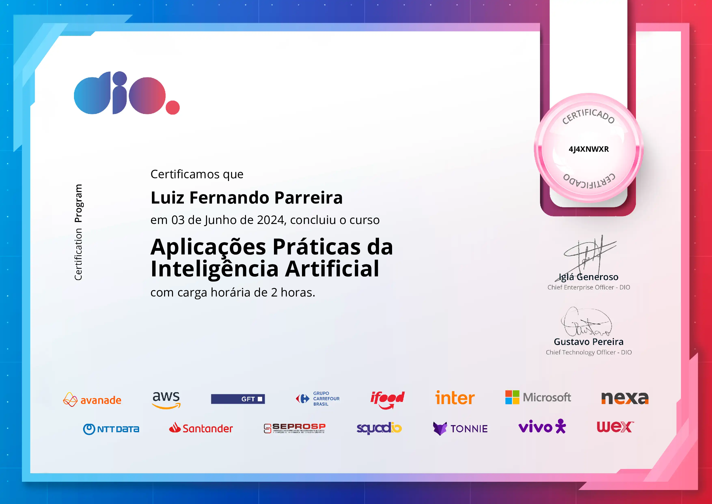
      </a>
    </td>
    <!-- Certificado 4 -->
    <td align="center">
      <a href="certificados_dio/AJ3SOW1S.png" target="_blank">
        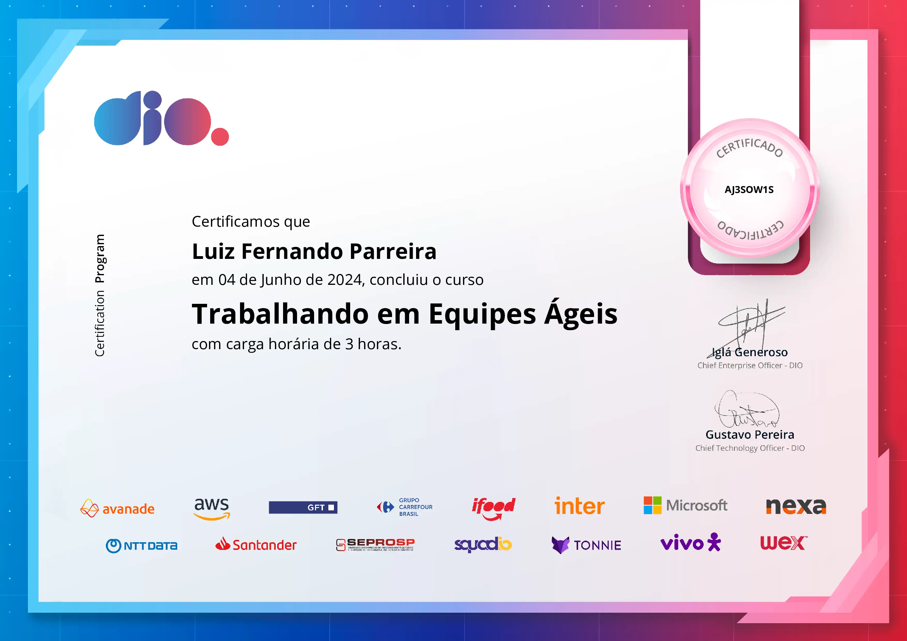
      </a>
    </td>
    <!-- Certificado 5 -->
    <td align="center">
      
    </td>
    <!-- Certificado 6 -->
    <td align="center">
      
    </td>
     
    <!-- Certificado 7 -->
    <td align="center">
      
    </td>
    <!-- Certificado 8 -->
    <td align="center">
      
    </td>
    <!-- Certificado 9 -->
    <td align="center">
      <a href="certificados_dio/HR9CVECA.png" target="_blank">
        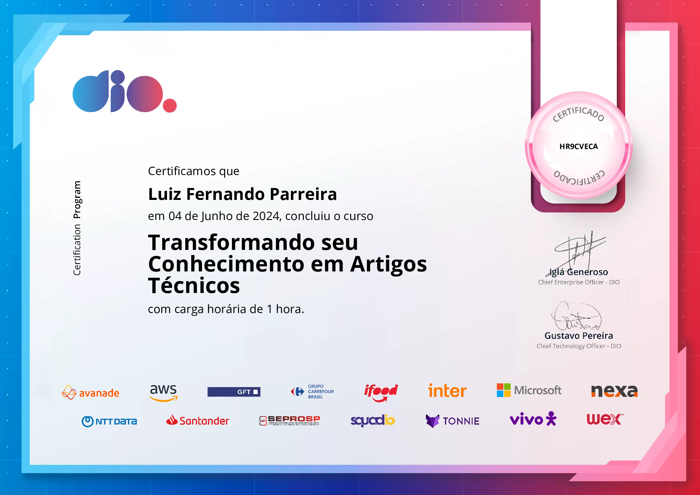
      </a>
    </td>
    <!-- Certificado 10 -->
    <td align="center">
      
    </td>
    <!-- Certificado 11 -->
    <td align="center">
      
    </td>
    <!-- Certificado 12 -->
    <td align="center">
      
    </td>
     
    <!-- Certificado 13 -->
    <td align="center">
      
    </td>
    <!-- Certificado 14 -->
    <td align="center">
      <a href="certificados_dio/OTQSYNSA.png" target="_blank">
        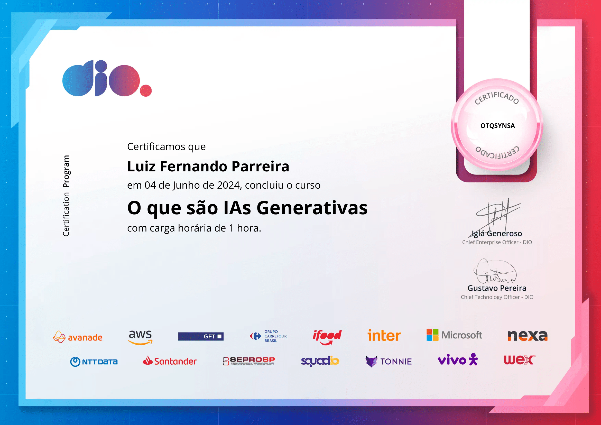
      </a>
    </td>
    <!-- Certificado 15 -->
    <td align="center">
      
    </td>
    <!-- Certificado 16 -->
    <td align="center">
      <a href="certificados_dio/QCE6J3GF.png" target="_blank">
        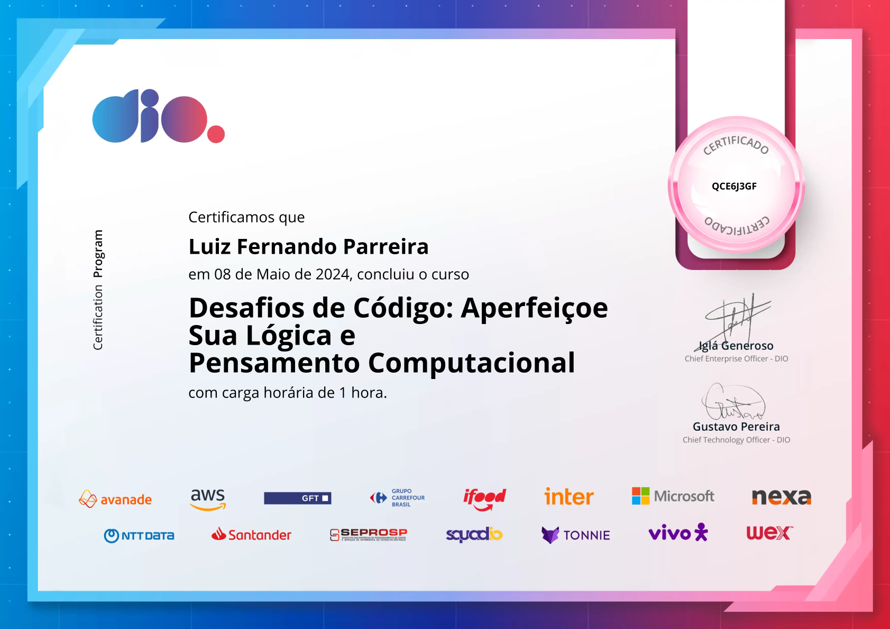
      </a>
    </td>
    <!-- Certificado 17 -->
    <td align="center">
      <a href="certificados_dio/QX3DIOO6.png" target="_blank">
        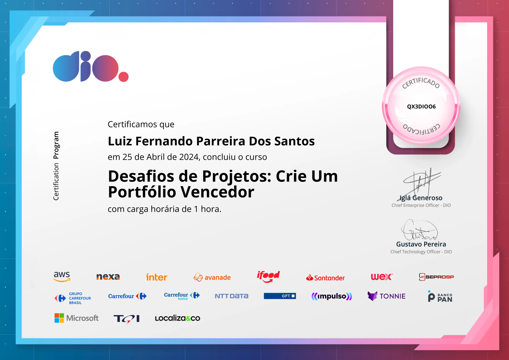
      </a>
    </td>
    <!-- Certificado 18 -->
    <td align="center">
      
    </td>
  <tr>
   
    <!-- Certificado 19 -->
    <td align="center">
      <a href="certificados_dio/UELYSPZQ.png" target="_blank">
        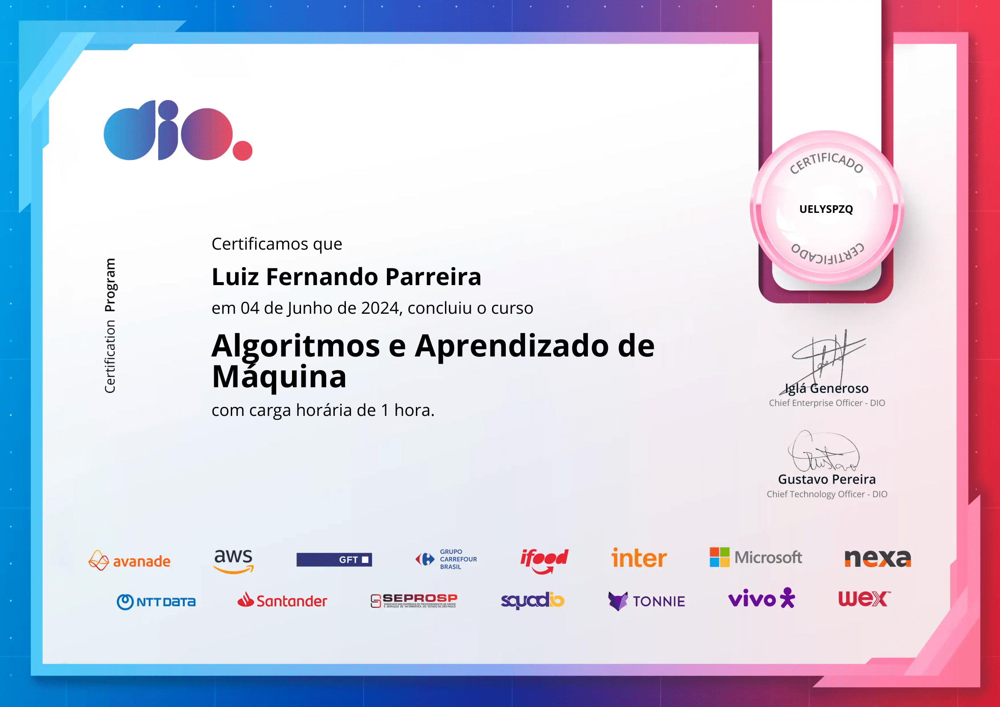
      </a>
    </td>
    <!-- Certificado 20 -->
    <td align="center">
      <a href="certificados_dio/UT2HVRXZ.png" target="_blank">
        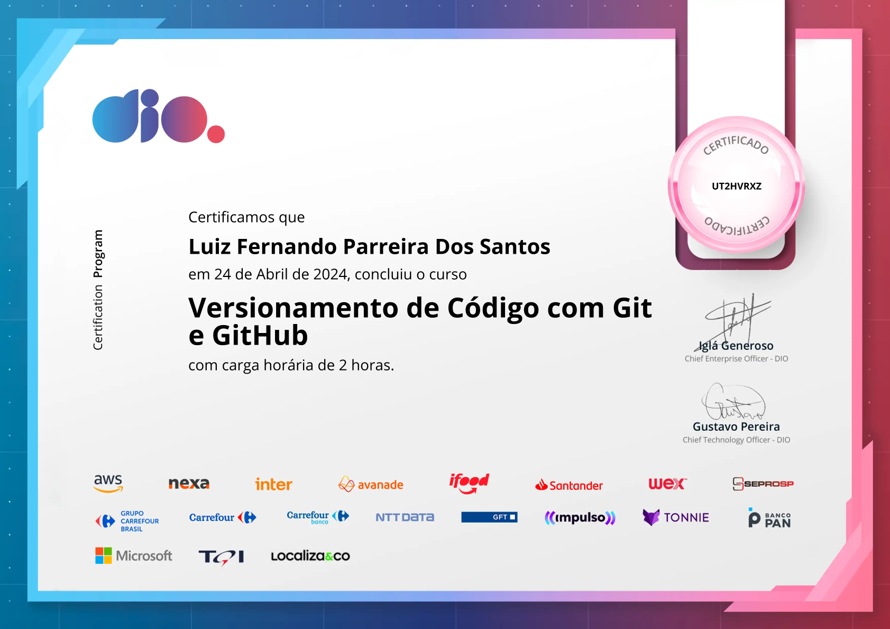
      </a>
    </td>
    <!-- Certificado 21 -->
    <td align="center">
      
    </td>
    <!-- Certificado 22 -->
    <td align="center">
      <a href="certificados_dio/UZBM4UU3.png" target="_blank">
        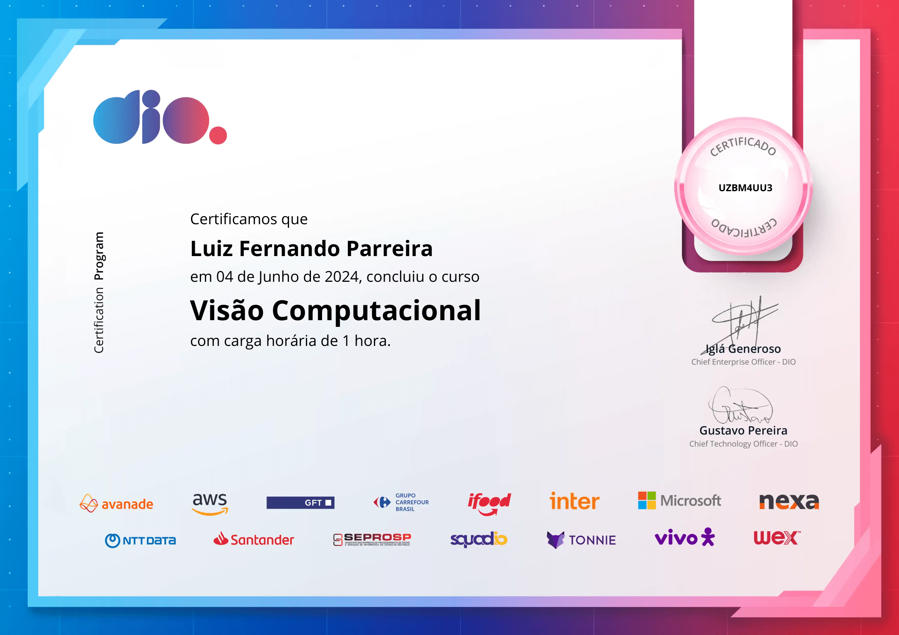
      </a>
    </td>
    <!-- Certificado 23 -->
    <td align="center">
      
    </td>
    <!-- Certificado 24 -->
    <td align="center">
      <a href="certificados_dio/X5JXJIYS.png" target="_blank">
        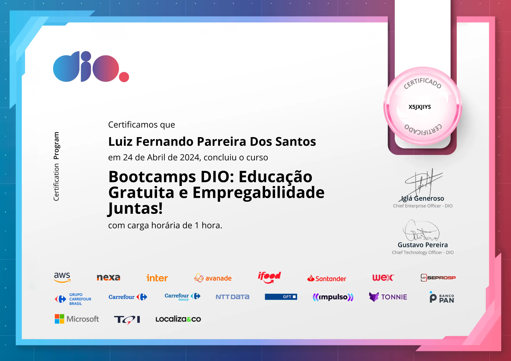
      </a>
    </td>
     
    <!-- Certificado 25 -->
    <td align="center">
      
    </td>
    <!-- Certificado 26 -->
    <td align="center">
      
    </td>
    <!-- Certificado 27 -->
    <td align="center">
      <a href="certificados_dio/Z9KYICKI.png" target="_blank">
        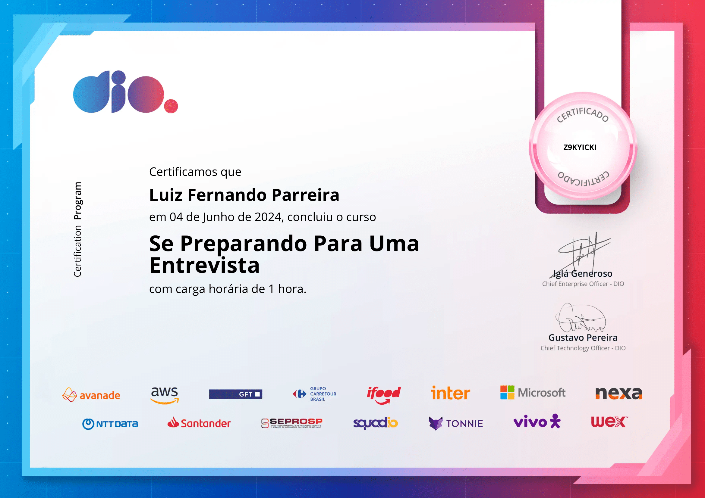
      </a>
    </td>
  </tr>
</table>

 
 
 
 

>"As coisas são mais belas quando vistas de cima.", Santos Dumont.

